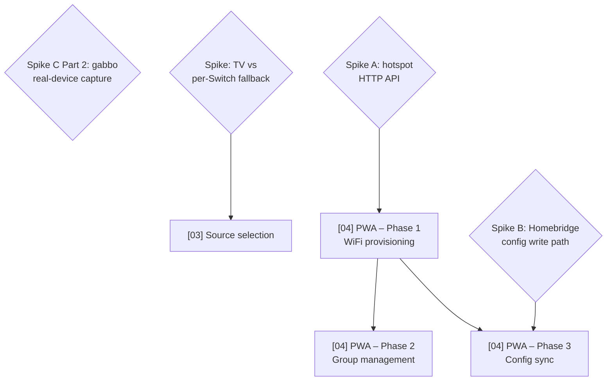

# Technical Roadmap

Last updated: 2026-07-17

This file gives the delivery order and dependency chain across all planned
features. The individual plan files contain the detail; this file answers
"what ships in what order and why." Done and cancelled items are removed —
see `plans/done/` for the historical record (`plans/cancelled/` is created
when the first plan is cancelled; none has been yet).

## Dependency graph

## Delivery order

| Order | Plan | Branch | Status | Why this position |
| ----- | ---- | ------ | ------ | ----------------- |
| 1 | **Speaker zones** | `feat/speaker-zones` | 🟢 Unblocked | `zones` config array; `SoundTouchZoneAccessory`; zone API activation at startup sync. `feat:` → minor. Zone API already implemented in `api/zone.ts`. The 2026-07-10 remediation batch (BoseCloudServer hardening #147, gabbo resilience #146, power state accuracy #144, plan hygiene #145) merged to `dev` ahead of this — awaiting the next beta cut. |
| 1b | **Power-on resume last-played source** | `fix/power-on-resume-last-source` | 🟢 Unblocked (parallel-safe with #1) | HomeKit "On" should resume the last-played source the way the physical power button does. Uses the device's `GET /recents` (currently parsed but dropped — `GabboClient.ts` maps `recentsUpdated` to `undefined`). Depends on `power-state-accuracy`'s `setOn` live-read fix, which is already merged (#144). No file overlap with speaker zones (`src/devices/SoundTouch/api/*`, `GabboClient.ts`, `SoundTouchSpeakerOnCharacteristic.ts` vs. zones' `src/zones/`, `platform.ts`, `PlatformConfiguration.ts`) — can run as a concurrent engineer dispatch alongside #1. `fix:` → patch. |
| 2 | **Spike C Part 2** | — | 🟡 Unblocked (needs real device) | Scope narrowed by the merged gabbo-resilience fix: reconnect/half-open handling shipped without capture data; remaining questions are standby socket behaviour and heartbeat cadence only. |
| 3 | **[03] Source selection** | `feat/source-selection` | 🔴 Blocked (spike) | Blocked on TV-vs-Switch spike (verify Television+InputSource on a real device). |
| 4 | **[04] PWA — Phase 1** | `feat/pwa` | 🔴 Blocked (spike A) | Blocked on spike A (reverse-engineer hotspot provisioning HTTP API at `http://192.0.2.1`). |
| 5 | **[04] PWA — Phase 2** | `feat/pwa` | 🔴 Blocked (needs P1) | Group management via zone API. Needs phase 1 scaffold. |
| 6 | **[04] PWA — Phase 3** | `feat/pwa` | 🔴 Blocked (spike B) | Homebridge config sync. Blocked on spike B + phase 1. |

## Session cost estimates

Per-plan estimate of how much of a single coding session each unit consumes.
Cost is driven by iteration loops (read → edit → test → lint → fix), not line
count. Bands: **Small** (room to spare), **Medium** (one fits comfortably),
**Heavy** (plan on one per session).

| Plan | Band | Drivers that set the band |
| ---- | ---- | ------------------------- |
| **Speaker zones** | Heavy | New `ZoneConfig` type + config schema; `zones` threaded through `PlatformConfiguration`; `SoundTouchZoneAccessory` + `SoundTouchZoneOnCharacteristic`; startup `getZone()` sync; zone set/dissolve via `setZone`/`removeZoneSlave`. |
| **Power-on resume last-played source** | Medium | Modifies existing `setOn` (must read + understand, plus rebase context from the already-merged power-state-accuracy fix); new `/recents` endpoint + client method is additive/low-risk; wiring `recentsUpdated` through `GabboClient` touches an existing notification map; moderate new test surface (API parsing, gabbo wiring, `setOn` behavior). |
| **[03] Source selection** | TBD (blocked) | Estimate after TV-vs-Switch spike resolves the architecture. |
| **[04] PWA — Phase 1–3** | TBD (blocked) | New `web/` workspace + embedded `src/server/`. Each phase its own session minimum. |

**Realistic capacity per session:** one Medium/Heavy plan fully verified and
pushed; a second only if the first reaches green with budget clearly remaining.

Estimate-vs-actual history lives in `CALIBRATION.md` (this directory) — consult
it when sizing a new plan against comparable past work, and append a row there
each time a unit ships.

## Spikes (blockers)

### Spike A — SoundTouch setup-mode hotspot HTTP API — mostly resolved (2026-07-17)
**Blocks:** [04] PWA Phase 1.

What we know:
- Enter setup mode: hold **PRESET 2 + VOLUME DOWN** until Wi-Fi indicator turns solid amber, on models that have those buttons. **On the project's real test device (SoundTouch Wireless Link Adapter), this does not apply** — see the model-specific procedure table and deep-dive in `plans/2026-06-19-progressive-web-app.md`; real-device testing found the documented 8–10s hold is wrong for this unit (actual threshold is ~2–4s).
- Speaker broadcasts a setup hotspot — **name is model-specific**, not a single fixed SSID. The Wireless Link Adapter broadcasts `Bose ST WLA (<last 3 MAC octets>)` (confirmed: `Bose ST WLA (FFAD16)`), not the generic "Bose SoundTouch Wi-Fi Network" from the general docs.
- Setup web UI is at `http://192.0.2.1` (port 80, plain HTTP — browsers flag it "Not Secure"). Note: `192.168.1.1` is a different Bose product — do not use.
- Standard SoundTouch API (port 8090) also available at `192.0.2.1:8090` during setup — **confirmed by real-device capture**, returns the same `/info` XML shape as normal operation.

What was resolved (real-device capture, 2026-07-17, against the Wireless Link Adapter):
2. **Scans for networks** — the setup UI performs a live WiFi scan and presents a dropdown of all nearby SSIDs (not just one guessed/pre-selected network); a "..." menu likely covers manual/hidden-network entry (not explored).
3. **Hotspot does not drop until the join actually succeeds** — a wrong password shows an X/retry state and the hotspot stays up for another attempt; only a successful join (checkmark) ends the setup hotspot.
4. **No, the phone does not auto-reconnect home-network** — after a successful join, the client device stays associated with (or disconnected from) the now-defunct setup hotspot and requires the user to manually reselect their home WiFi. The **speaker/adapter itself** does rejoin the home network and its previous DHCP lease automatically (confirmed reachable at the same IP immediately after). The PWA must account for this — after a successful join, show the user an explicit "reconnect your phone to WiFi manually" instruction rather than assuming automatic hand-back.

Still open:
1. **Exact request/response shape of the join submission is still unconfirmed.** Mobile Safari has no devtools network tab, so the actual form `action`/method and payload weren't captured — only the rendered UI and outcomes (scan dropdown, unlabeled submit button, X-vs-checkmark result states) were observed. If Phase 1 implementation needs the literal wire format (rather than just replicating the observed UX), a follow-up capture from a laptop connected directly to the hotspot (with real devtools) is still needed.

### Spike B — Homebridge config write path
**Blocks:** [04] PWA Phase 3.

What must be resolved:
1. `api.user.storagePath()` gives the writable directory — confirm atomic write (write-then-rename) doesn't corrupt Homebridge state.
2. Does Homebridge Config UI X watch for external config changes and reload, or is a restart always required?

### Spike C Part 2 — gabbo WebSocket real-device capture — RESOLVED (2026-07-17)
**Blocked:** [07] WebSocket Phase 3. Part 1 complete (#66).

**Status (2026-06-22):** Questions 1 and 2 were **confirmed** by reference implementation `Dress13/homebridge-bose-soundtouch` (TypeScript, real-device tested): `gabbo` sub-protocol accepted; all major event shapes match the v1.1 reference; several carry inline data (volume, nowPlaying, presets, zone, bass). Fixed 5 s reconnect + 30 s client-side ping confirmed sufficient in practice.

**Real-device capture completed 2026-07-17** against the "Remote" speaker (10.0.0.22), resolving the last two open questions:

3. Heartbeat / idle-timeout cadence — **no server heartbeat at all**; the socket is push-only and silent when nothing changes (2+ min fully idle produced zero traffic after the initial handshake).
4. Standby/power-off socket behaviour — **socket stays open and silent**; 113 s of standby produced no close/ping/traffic, and on power-on, activity (including last-source resume) arrived on the same connection with no reconnect needed.

**Conclusion:** no idle-timeout defense or standby-triggered reconnect logic is needed for Phase 3 — the existing 5 s reconnect-on-`close` + 30 s client ping (already implemented) is sufficient, since standby produces no traffic rather than a drop. Findings recorded in `plans/done/2026-06-20-websocket-push.md` Decisions & findings (2026-07-17 row). Phase 3 (relax/disable polling fallback, handle reconnect + zone sequences) is now unblocked and can be scoped as a follow-up session against that plan.

## Key coupling notes

- **WebSocket push (plan 07) augments polling — it does not replace it.** Phase 1/2 is in beta. Polling stays as a fallback until Phase 3 resolves standby/reconnect behaviour.
- **Source selection is the highest-risk HomeKit feature.** The Television+InputSource pattern has real caveats (external publishing, `Active`/`On` power model clash, buried UX). The per-source Switch fallback is Plan B if the TV path is too rough.
- **The PWA is architecturally independent** from the HomeKit features. It introduces a new `web/` workspace and `src/server/` embedded HTTP server — no overlap with the HAP characteristic layer.
- **Typed preset management (plan 08) is in beta.** A future plan can wire up HomeKit controls (preset select, station status) or PWA management once the current Bose cloud emulator/manual setup path is settled.

## Backlog (not yet planned)

- **Preset-sync host/port decoupling.** soundcork users shouldn't need
  `server.enabled` to use preset sync. Platform gating is already independent
  (`_setupPresets` keys off `presetSyncEnabled` only), but there is no
  `presetSync.host`/`presetSync.port` override — presets store relative
  `location` paths and playback relies on the DNS redirect described in
  `docs/bose-cloud-setup.md`. Needs an architect plan when prioritised.
- **Volume-slider debounce + refresh coalescing.** Deliberately deferred from
  the power-state-accuracy plan (last-write-wins today, harmless). Revisit
  alongside source selection, which adds more characteristic traffic.
