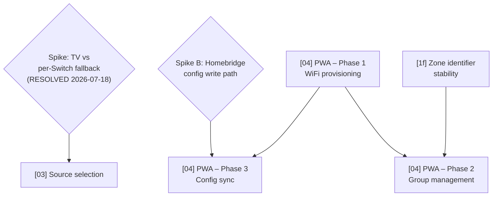

# Technical Roadmap

Last updated: 2026-07-19 (zone `On` debounce fix — third instance of the read-then-act race, confirmed on hardware)

This file gives the delivery order and dependency chain across all planned
features. The individual plan files contain the detail; this file answers
"what ships in what order and why." Done and cancelled items are removed —
see `plans/done/` for the historical record (`plans/cancelled/` is created
when the first plan is cancelled; none has been yet).

## Dependency graph

## Delivery order

| Order | Plan | Branch | Status | Why this position |
| ----- | ---- | ------ | ------ | ----------------- |
| 1a | **[fix] Zone `On` debounce — coalesce rapid zone setOn calls (`_ensureDevicesPowered` race)** | `fix/zone-on-debounce` → **PR #185 (green, `needs-qa`)** | 🔴 **BLOCKING dev → beta** — PR open on `dev`, CI green (493 tests), awaiting real-device slider-drag re-verification | **Third confirmed instance of the read-then-act race in the zone subsystem** (after #144→#178/#179 for the standalone speaker, and #181 for the zone volume path). Real-device QA on 2026-07-19 (`.claude/qa/2026-07-18-pre-release-test-plan.md`, "BLOCKING — F2") reproduced it: rapid slider-drag-driven zone on/off toggling (3 activate/deactivate calls in a 5s window) left the two zone members in **different** power states after settling — Kitchen in STANDBY, Changing Room still playing TUNEIN — confirmed by direct device reads, not a stale tile. `SoundTouchZoneOnCharacteristic.setOn` → `_ensureDevicesPowered` does an unserialized per-device live-read-then-hold via `Promise.all`, uncoordinated against overlapping `setOn` calls on the same instance. **This overturns the earlier "backlog, lower priority" assessment** (see reversal note below): that assessment assumed zone power is tile-tap cadence (occasional, non-compounding); hardware showed a HomeKit Lightbulb's Brightness and On characteristics are coupled, so a brightness-slider drag near zero fires the zone's own `setOn` rapidly — slider cadence, not tap cadence. Fix ports the debounce pattern proven twice (#179 `SoundTouchSpeakerOnCharacteristic.setOn`, #181 `SoundTouchZoneVolumeCharacteristic.setBrightness`): record desired value, restart a 400ms timer, ack HAP promptly, run the real action (`_ensureDevicesPowered` + `_applyDefaultSourceIfIdle`/`setZone`/`removeZoneSlave`) once against the last value, catch-and-log, live-re-read `updateValue` (mirroring `_isZoneActive`) after settle. `fix:` → patch. Edits only `SoundTouchZoneOnCharacteristic.ts` (+ its test). Mandatory real-device re-verification before promotion. |
| 1b | **[fix] Zone volume debounce — coalesce rapid slider drags** | `fix/zone-volume-debounce` → **PR #181 (green, `needs-qa`)** | 🟡 **PR open on `dev` — awaiting real-device slider-drag re-verification** | Found during a 2026-07-19 standards audit of `src/zones/` and `src/devices/SoundTouch/api/`, prompted by the same QA session that surfaced #144/#166/#145. `SoundTouchZoneVolumeCharacteristic.setBrightness` (`src/zones/SoundTouchZoneVolumeCharacteristic.ts:75-96`) is an unserialized read-then-act computing a **relative** delta (read primary's current volume → `delta = target - current` → apply `current + delta` to every member). HAP does not serialize rapid `onSet` calls, and a Home-app brightness-slider drag fires many; because the write is relative, overlapping calls compound drift rather than converging (unlike the standalone speaker brightness path, which writes an absolute value and is self-correcting — see the amended backlog note below). Same race class as #144's `setOn` bug, different file. Fix ports the debounce pattern PR #179 settled for `SoundTouchSpeakerOnCharacteristic.setOn` (record desired value, restart a 400ms timer, ack HAP promptly without blocking on the device action, run the read-then-act once when the window elapses against the LAST value, catch-and-log, live-re-read `updateValue` after settle). `fix:` → patch. Edits only `SoundTouchZoneVolumeCharacteristic.ts` (+ its test, + the zone-volume integration test's timer expectations). Deliberately does **not** touch `SoundTouchZoneOnCharacteristic.setOn`'s milder `_ensureDevicesPowered` read-then-act — see the new backlog note below for why that was scoped out. |
| 1d | **Preserve HomeKit accessory renames** | `fix/preserve-homekit-rename` | 🟢 Unblocked | Confirmed user bug: Home-app renames of a speaker (or zone) accessory revert on the next Homebridge restart, because `SoundTouchSpeakerInformationCharacteristic`/`SoundTouchZoneAccessory` re-push the HAP `Name` characteristic on every `init()`, including cache-restore — HomeKit treats that as an authoritative rename. Fix: only set `Name` on true first-creation (an `isNewAccessory` signal threaded down from `discoverDevices()`); keep unconditionally refreshing Manufacturer/Model/SerialNumber/FirmwareRevision. `fix:` → patch. Speaker and zone halves can ship together now that both `SoundTouchSpeakerInformationCharacteristic` and `SoundTouchZoneAccessory` are on `dev`. Manual real-device/Home-app verification required (HomeKit's rename storage is outside this plugin, unit-testable only via a simulated restart cycle). Plan: `plans/2026-07-18-preserve-homekit-rename.md`. |
| 1f | **Zone identifier stability** | `fix/zone-stable-device-id` | 🟢 Unblocked | Follow-up to Speaker zones (merged #162): `_resolveZones()` currently keys `primary`/`slaves` to devices by mutable name string (`device.name === name`), so renaming a speaker (config `name` override **or** the device's Bose-app-reported name) silently orphans the zone — it warns, skips, and is then pruned from the Home app. Fix mirrors the preserve-homekit-rename precedent (1d): keep config name-authored, but resolve names → stable `device.id` once at startup and persist the mapping in the zone accessory's `context.memberDeviceIds`; resolution becomes name-match-first, persisted-id-fallback-second, so a later rename keeps working without a config edit. `fix:` → patch. Orthogonal to the merged 1c/1e (#166/#165) — edits only `platform.ts` resolution, not `SoundTouchZoneOnCharacteristic.ts`/`SoundTouchZoneVolumeCharacteristic.ts`. **Sequenced ahead of PWA Phase 2** so the group-management UI builds on the id-keyed model. Plan: `plans/2026-07-18-zone-stable-device-id.md`. |
| 2 | **[03] Source selection** | `feat/source-selection` | 🟢 Unblocked | TV-vs-Switch spike RESOLVED 2026-07-18: Television+InputSource confirmed on a real device, Plan B retired. Scope now firm — opt-in `sourceSelectionEnabled` external TV accessory; power tiles kept in lock-step via the gabbo refresh path; SPOTIFY sources excluded; presets-as-inputs included in v1 per direct user instruction (overrides earlier Phase-2 deferral), with mandatory on-device verification since this wasn't live-tested in the spike. Ready to brief/implement. |
| 3 | **[04] PWA — Phase 1** | `feat/pwa` | 🟢 Unblocked | Spike A resolved 2026-07-17 — exact `performWirelessSiteSurvey`/`addWirelessProfile` wire format recovered from the device's own setup UI. Ready to plan/implement. |
| 4 | **[04] PWA — Phase 2** | `feat/pwa` | 🔴 Blocked (needs P1 + 1f) | Group management via zone API. Needs phase 1 scaffold. **Should build on 1f (Zone identifier stability)** — its rename/group-edit UI must not silently orphan zones, so land 1f's id-keyed model first. |
| 5 | **[04] PWA — Phase 3** | `feat/pwa` | 🔴 Blocked (spike B) | Homebridge config sync. Blocked on spike B + phase 1. |

## Session cost estimates

Per-plan estimate of how much of a single coding session each unit consumes.
Cost is driven by iteration loops (read → edit → test → lint → fix), not line
count. Bands: **Small** (room to spare), **Medium** (one fits comfortably),
**Heavy** (plan on one per session).

| Plan | Band | Drivers that set the band |
| ---- | ---- | ------------------------- |
| **[fix] Zone `On` debounce** | Small–Medium | Single-file behavioral change (`SoundTouchZoneOnCharacteristic.setOn`) mirroring the twice-proven #179/#181 debounce, so no new primitive to design. Cost driver is the regression test: fake timers, coalescing N rapid setOn calls → exactly one full `_ensureDevicesPowered`/`setZone`-or-`removeZoneSlave` action targeting the LAST value, prompt-ack-without-blocking (each `setOn` promise resolves fast — the assertion that would have caught tonight's bug, per #178's insufficient first attempt), single-non-bursted-call still correct, and live-re-read `updateValue` (mirroring `_isZoneActive`) after settle. Slight extra vs #181: the debounced action wraps three existing helpers (`_ensureDevicesPowered` + `_applyDefaultSourceIfIdle`/`setZone`/`removeZoneSlave`), and there are two branches (on/off) to move inside the timer. |
| **[fix] Zone volume debounce** | Small–Medium | Single-file behavioral change mirroring a just-merged pattern (#179), so no new primitive to design — but the regression test is the cost driver: fake timers, coalescing (N rapid calls → one settled action targeting the last value, delta computed from a single fire-time read), prompt-ack-without-blocking, newer-supersedes-older, live-re-read-after-settle, and failure-is-caught, plus adapting the existing synchronous `setBrightness` tests and one integration test to the debounced flow. |
| **Speaker zones** | Heavy | New `ZoneConfig` type + config schema; `zones` threaded through `PlatformConfiguration`; `SoundTouchZoneAccessory` + `SoundTouchZoneOnCharacteristic`; startup `getZone()` sync; zone set/dissolve via `setZone`/`removeZoneSlave`. |
| **Zone default source** | Small–Medium | Small config addition (`defaultSource` union threaded through the three config layers + validation, mirroring the existing preset-slot validation) plus one focused change to `SoundTouchZoneOnCharacteristic.setOn` (`_applyDefaultSourceIfIdle`: `getNowPlaying` idle-check → `getPresets` resolve → `selectSource` before `setZone`). Bounded new test surface (unit call-order/fill-if-empty + one integration extension). Mandatory real-device verification of the compose with the #162 power-on and #161 resume paths pushes it toward Medium. |
| **Preserve HomeKit accessory renames** | Small | An `isNewAccessory` signal threaded through two existing static-factory chains (speaker + zone) from `discoverDevices()`, gating one `setCharacteristic(Name, ...)` call each. Bounded test surface (unit gate matrix + one restart-cycle integration scenario). Mandatory manual Home-app verification since HomeKit's rename storage is outside the plugin. |
| **Zone state reconciliation** | Small | One-line primary-power gate added to `_isZoneActive()`, plus a reconciliation loop in `SoundTouchZoneAccessory` mirroring the already-proven `SoundTouchSpeakerPlatformAccessory` pattern (same shape, different interval). Test surface follows the existing fake-timer pattern from `SoundTouchSpeakerPlatformAccessory.test.ts`. Must serialize with Zone default source (same files). |
| **Zone identifier stability** | Small–Medium | Rework of `_resolveZones()` in `platform.ts` only: add `_findDeviceById`, a name-first/persisted-id-fallback resolver per member, and persist a `context.memberDeviceIds` map with a change-gated `updatePlatformAccessories` write (mirrors the existing speaker `contextChanged` pattern). No config-shape change, no `soundtouch-api` work. Test surface is the driver: a resolution-tier unit matrix (fresh / renamed / re-pointed / member-gone / transient-absence merge) plus a cross-restart rename integration scenario. Mandatory real-device verification (rename via config **and** via the Bose app so `info.name` changes). |
| **Power-on resume last-played source** | Medium | Modifies existing `setOn` (must read + understand, plus rebase context from the already-merged power-state-accuracy fix); new `/recents` endpoint + client method is additive/low-risk; wiring `recentsUpdated` through `GabboClient` touches an existing notification map; moderate new test surface (API parsing, gabbo wiring, `setOn` behavior). |
| **[03] Source selection** | Heavy | Spike settled the architecture. New opt-in config field threaded through schema + `ExternalPlatformConfig` + `PlatformConfiguration` + tests; a new external-accessory publishing path in `discoverDevices` (kept out of the bridged cache/prune loops, with its own teardown); a new `SoundTouchTVAccessory` wrapper plus `Active` + `ActiveIdentifier` characteristics wired into the gabbo refresh path for power lock-step; SPOTIFY/status filtering + `ContentItem` mapping tests. On-device verification is mandatory (external pairing + power-tile lock-step). |
| **[04] PWA — Phase 1** | Heavy | Unblocked but not yet estimated in detail — new `web/` workspace (Vite + Svelte 5) + embedded hapi server scaffolding from scratch, plus the join flow (`performWirelessSiteSurvey`/`addWirelessProfile`) and offline-first PWA install/service-worker concerns. Likely needs its own architect pass to split into sub-sessions before briefing. |
| **[04] PWA — Phase 2–3** | TBD (blocked) | Each phase its own session minimum once Phase 1 scaffold exists. |

**Realistic capacity per session:** one Medium/Heavy plan fully verified and
pushed; a second only if the first reaches green with budget clearly remaining.

Estimate-vs-actual history lives in `CALIBRATION.md` (this directory) — consult
it when sizing a new plan against comparable past work, and append a row there
each time a unit ships.

## Spikes (blockers)

### Spike A — SoundTouch setup-mode hotspot HTTP API — RESOLVED (2026-07-17)
**Blocked:** [04] PWA Phase 1.

What we know:
- Enter setup mode: hold **PRESET 2 + VOLUME DOWN** until Wi-Fi indicator turns solid amber, on models that have those buttons. **On the project's real test device (SoundTouch Wireless Link Adapter), this does not apply** — see the model-specific procedure table and deep-dive in `plans/2026-06-19-progressive-web-app.md`; real-device testing found the documented 8–10s hold is wrong for this unit (actual threshold is ~2–4s).
- Speaker broadcasts a setup hotspot — **name is model-specific**, not a single fixed SSID. The Wireless Link Adapter broadcasts `Bose ST WLA (<last 3 MAC octets>)`, not the generic "Bose SoundTouch Wi-Fi Network" from the general docs.
- Setup web UI is at `http://192.0.2.1` (port 80, plain HTTP — browsers flag it "Not Secure"). Note: `192.168.1.1` is a different Bose product — do not use.
- Standard SoundTouch API (port 8090) also available at `192.0.2.1:8090` during setup — **confirmed by real-device capture**, returns the same `/info` XML shape as normal operation.

What was resolved (real-device capture, 2026-07-17, against the Wireless Link Adapter):
1. **Exact request/response wire format recovered directly from the setup UI's own served JS** (`http://192.0.2.1/js/ap.js`) — no guessing needed. Network scan: `POST <host>:8090/performWirelessSiteSurvey` with body `<PerformWirelessSiteSurvey timeout="5"/>` (XML content type); returns `<item ssid="…" signalStrength="…"><securityTypes><type>…</type></securityTypes></item>` per network. Join: `POST <host>:8090/addWirelessProfile` with body `<AddWirelessProfile><profile ssid="$SSID" password="$PASSWORD" securityType="$SECURITY"></profile></AddWirelessProfile>` (`password`/`securityType` omitted for open networks). Valid `securityType` values: `none`, `wep`, `wpa_or_wpa2`. Full detail in `plans/2026-06-19-progressive-web-app.md` Decisions & findings.
2. **Scans for networks** — confirmed both behaviorally and in source: a live WiFi scan via `performWirelessSiteSurvey`, de-duped and filtered (any SSID starting with `"Bose "` is dropped) client-side.
3. **Hotspot does not drop until the join actually succeeds** — a wrong password shows an X/retry state and the hotspot stays up for another attempt; only a successful join (checkmark) ends the setup hotspot. The success/error UI is driven directly by the `addWirelessProfile` AJAX call's own callback.
4. **No, the phone does not auto-reconnect home-network** — after a successful join, the client device stays associated with (or disconnected from) the now-defunct setup hotspot and requires the user to manually reselect their home WiFi. The **speaker/adapter itself** does rejoin the home network and its previous DHCP lease automatically (confirmed reachable at the same IP immediately after). The PWA must account for this — after a successful join, show the user an explicit "reconnect your phone to WiFi manually" instruction rather than assuming automatic hand-back.

All four original questions are answered. One incidental finding, role unconfirmed: `GET <host>:8090/setup` returns `<setupStateResponse state="SETUP_AP_OOB" systemstate="SETUP_LANG_SET" />` — a real out-of-box/setup-state endpoint not referenced by this page's JS, possibly used by a different step (e.g. language selection) not exercised in this capture. Not blocking — Phase 1 can implement directly against the two confirmed endpoints.

### Spike B — Homebridge config write path
**Blocks:** [04] PWA Phase 3.

What must be resolved:
1. `api.user.storagePath()` gives the writable directory — confirm atomic write (write-then-rename) doesn't corrupt Homebridge state.
2. Does Homebridge Config UI X watch for external config changes and reload, or is a restart always required?

### Spike C Part 2 — gabbo WebSocket real-device capture — RESOLVED (2026-07-17)
**Blocked:** [07] WebSocket Phase 3. Part 1 complete (#66).

**Status (2026-06-22):** Questions 1 and 2 were **confirmed** by reference implementation `Dress13/homebridge-bose-soundtouch` (TypeScript, real-device tested): `gabbo` sub-protocol accepted; all major event shapes match the v1.1 reference; several carry inline data (volume, nowPlaying, presets, zone, bass). Fixed 5 s reconnect + 30 s client-side ping confirmed sufficient in practice.

**Real-device capture completed 2026-07-17** against the "Remote" speaker (10.0.0.22), resolving the last two open questions:

3. Heartbeat / idle-timeout cadence — **no server heartbeat at all**; the socket is push-only and silent when nothing changes (2+ min fully idle produced zero traffic after the initial handshake).
4. Standby/power-off socket behaviour — **socket stays open and silent**; 113 s of standby produced no close/ping/traffic, and on power-on, activity (including last-source resume) arrived on the same connection with no reconnect needed.

**Conclusion:** no idle-timeout defense or standby-triggered reconnect logic is needed for Phase 3 — the existing 5 s reconnect-on-`close` + 30 s client ping (already implemented) is sufficient, since standby produces no traffic rather than a drop. Findings recorded in `plans/done/2026-06-20-websocket-push.md` Decisions & findings (2026-07-17 row). Phase 3 (relax/disable polling fallback, handle reconnect + zone sequences) is now unblocked and can be scoped as a follow-up session against that plan.

## Key coupling notes

- **Zone volume debounce (1b) ports the #179 `setOn` debounce pattern to a second file.**
  Both fixes solve "HAP doesn't serialize rapid `onSet` calls" with the same
  shape (debounce timer decoupled from the HAP ack, catch-and-log on the
  debounced action, live-re-read `updateValue` after settle) — 1b reuses that
  design rather than inventing a new one, so review can compare the two
  characteristics directly. It is orthogonal to `setOn`/#179 itself (different
  file) and to the zone `On`/`_ensureDevicesPowered` path (now fixed under
  delivery order 1a), so it required no serialization with either.
- **Zone `On` debounce (1a) ports the same #179/#181 pattern to a THIRD file.**
  `SoundTouchZoneOnCharacteristic.setOn` had the same unserialized
  read-then-act race as #144/#181; 1a coalesces it identically. It edits only
  `SoundTouchZoneOnCharacteristic.ts` (+ its test), so it does not overlap
  1b/1f or the zone volume path and needs no serialization — but it **blocks
  the dev → beta promotion of the current batch** until fixed and re-verified
  on hardware, since the bug leaves zone members in genuinely inconsistent
  power states.
- **WebSocket push (plan 07) augments polling — it does not replace it.** Phase 1/2 is in beta. Polling stays as a fallback until Phase 3 resolves standby/reconnect behaviour.
- **Zone identifier stability (1f) is orthogonal to the merged 1c/1e (#166/#165) but gates PWA Phase 2.**
  It edits only the resolution step in `platform.ts` (`_resolveZones()` /
  `_registerZoneAccessory()`), not the zone characteristics 1c/1e touched, so
  it required no serialization with them. It replaces name-string member
  matching with a name-first / persisted-`device.id`-fallback model (config
  stays name-authored; the id mapping is persisted in the zone accessory's
  `context.memberDeviceIds`), the same "stable identifier + free-changing
  display name" fix pattern as 1d (preserve HomeKit renames). Sequenced
  **ahead of PWA Phase 2**, whose group-management/rename UI would otherwise
  silently orphan zones against a mutable name key.
- **Source selection: architecture settled (spike RESOLVED 2026-07-18).** Television+InputSource confirmed on a real device; Plan B (per-source Switches) retired. Remaining build risk is the `Active`/`On` power lock-step — solved by wiring the external TV accessory into the same gabbo `gabboEvents` refresh path the bridged `On` already uses (do not replace the existing `On` surface). Opt-in per device; SPOTIFY excluded; presets-as-inputs included in v1 (per direct user instruction, overriding an earlier Phase-2 deferral) — requires mandatory on-device verification, since this path was typechecked/linted but not live-tested in the spike. Detail in `plans/2026-06-19-source-selection.md`.
- **Zone default source (1c) is a strict follow-on to Speaker zones (#1)** — it
  extends the same zone activation path and edits the same files, so it is gated
  on #162 merging to `dev` (cannot run in parallel). Its fill-if-empty trigger is
  what keeps it from fighting the #162 zone power-on fix and the #161
  resume-last-source behavior: the default source is only selected when the
  primary is idle at activation. Shares the `selectSource(contentItem)` +
  `getPresets()` machinery with [03] source selection but has no hard dependency
  on it.
- **Preserve HomeKit accessory renames (1d) shares `discoverDevices()` plumbing
  with Speaker zones (#1).** Both need an `isNewAccessory` signal computed in
  the same restore-vs-create branch of `discoverDevices()`; the zone half of 1d
  either folds directly into #162 or is rebased on top right after it merges,
  to avoid two independent PRs editing the same method.
- **Zone state reconciliation (1e) must serialize with Zone default source
  (1c)** — both edit `SoundTouchZoneOnCharacteristic.ts` and
  `SoundTouchZoneAccessory.ts` (different methods, same files); run one after
  the other in either order, never in parallel. Zone accessories currently have
  no gabbo push wiring at all, which is why 1e's poll is a primary correction
  path rather than a backstop like the speaker accessories' 5-minute poll.
- **The PWA is architecturally independent** from the HomeKit features. It introduces a new `web/` workspace and `src/server/` embedded HTTP server — no overlap with the HAP characteristic layer.
- **Typed preset management (plan 08) is in beta.** A future plan can wire up HomeKit controls (preset select, station status) or PWA management once the current Bose cloud emulator/manual setup path is settled.

## Backlog (not yet planned)

- **Preset-sync host/port decoupling.** soundcork users shouldn't need
  `server.enabled` to use preset sync. Platform gating is already independent
  (`_setupPresets` keys off `presetSyncEnabled` only), but there is no
  `presetSync.host`/`presetSync.port` override — presets store relative
  `location` paths and playback relies on the DNS redirect described in
  `docs/bose-cloud-setup.md`. Needs an architect plan when prioritised.
- **Volume-slider debounce + refresh coalescing (standalone speaker path only).**
  Deliberately deferred from the power-state-accuracy plan. Still harmless:
  `SoundTouchSpeakerBrightnessCharacteristic.setBrightness` writes an
  **absolute** value (`setVolume(brightness)`), so the last write to complete
  is self-correcting even under concurrent calls — no compounding risk.
  *(The zone volume path had the same open item but was a genuine
  compounding race because it writes a relative delta; that half was fixed
  2026-07-19 via PR #181 (see delivery order 1b) rather than left deferred.)*
  Revisit the standalone path alongside source selection, which adds more
  characteristic traffic.
- **~~Zone `On` characteristic's `_ensureDevicesPowered` read-then-act — lower
  priority than the volume fix.~~ REVERSED 2026-07-19 — promoted to delivery
  order 1a (blocking dev → beta).** The original assessment (from the
  2026-07-19 audit / F1 review, PR #182) scoped this out of #181 on the
  reasoning that "zone power is a tile tap (occasional, non-compounding), not
  a slider drag (rapid, HAP-unserialized), so the concurrency window that
  makes the volume path urgent is much less likely to open." **Real hardware
  directly contradicted that reasoning** (QA 2026-07-19, F2): a HomeKit
  Lightbulb's Brightness and On characteristics are *coupled* — dragging a
  zone's brightness slider near zero also fires the zone's own `On`
  characteristic (`setOn`) rapidly, so a volume drag IS a realistic trigger
  for rapid zone `setOn` bursts, not just deliberate tile-tapping. The race
  reproduced: 3 activate/deactivate calls in a 5s window left the two zone
  members in genuinely inconsistent power states (one STANDBY, one still
  playing), confirmed by direct device reads. It is now a confirmed,
  hardware-reproduced bug being fixed under delivery order 1a — not a backlog
  item. This bullet is retained (struck through) so the record shows the
  assessment was overturned by evidence rather than silently deleted.
