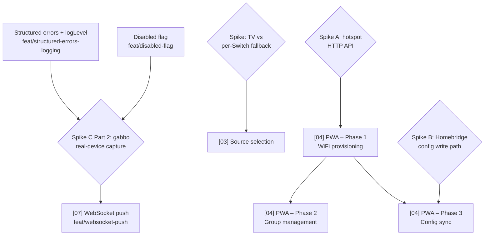

# Technical Roadmap

Last updated: 2026-06-21 (post v0.3.0 stable release)

This file gives the delivery order and dependency chain across all planned
features. The individual plan files contain the detail; this file answers
"what ships in what order and why." Done and cancelled items are removed —
see `plans/done/` and `plans/cancelled/` for the historical record.

## Dependency graph

## Delivery order

| Order | Plan | Branch | Status | Why this position |
| ----- | ---- | ------ | ------ | ----------------- |
| 1 | **Static factory enforcement** | `refactor/static-factory-enforcement` | 🟢 Next (unblocked) | Private constructors on all ten classes + `API.create()` factory. `refactor:` → no release. Small, purely mechanical, no new tests. |
| 2 | **Disabled flag** | `feat/disabled-flag` | 🟢 Next (unblocked) | `disabled: true` per-accessory unregisters speaker from HomeKit without removing config. `feat:` → minor. Testing prerequisite for WebSocket push. |
| 3 | **Structured errors + logLevel** | `feat/structured-errors-logging` | 🟢 Next (unblocked) | `ContextError` + native `Error.cause` chaining; `logLevel` config replaces `verbose: boolean`; level-aware `FormattedLogger.error()`. `feat:` → minor. Testing prerequisite for WebSocket push. |
| 4 | **CHANGELOG** | `docs/changelog` | 🔵 In-progress (#111) | Introduce `CHANGELOG.md` + wire `@semantic-release/changelog` / `@semantic-release/git`. `docs:` → no release. |
| 5 | **Speaker zones** | `feat/speaker-zones` | 🟢 Unblocked | `zones` config array; `SoundTouchZoneAccessory`; zone API activation at startup sync. `feat:` → minor. Zone API already implemented in `api/zone.ts`. |
| 6 | **Spike C Part 2** | — | 🟡 Unblocked (needs real device) | Real-device gabbo capture session. Run after disabled flag + logging land. Unblocks [07] WebSocket push. |
| 7 | **[07] WebSocket push (gabbo)** | `feat/websocket-push` | 🔴 Blocked | Blocked on disabled flag + logging (testing prerequisites) and Spike C Part 2. Phased: P1 connection+lifecycle, P2 per-event mapping, P3 tune polling + edges. |
| 8 | **[03] Source selection** | `feat/source-selection` | 🔴 Blocked (spike) | Blocked on TV-vs-Switch spike (verify Television+InputSource on a real device). |
| 9 | **[04] PWA — Phase 1** | `feat/pwa` | 🔴 Blocked (spike A) | Blocked on spike A (reverse-engineer hotspot provisioning HTTP API at `http://192.0.2.1`). |
| 10 | **[04] PWA — Phase 2** | `feat/pwa` | 🔴 Blocked (needs P1) | Group management via zone API. Needs phase 1 scaffold. |
| 11 | **[04] PWA — Phase 3** | `feat/pwa` | 🔴 Blocked (spike B) | Homebridge config sync. Blocked on spike B + phase 1. |

## Session cost estimates

Per-plan estimate of how much of a single coding session each unit consumes.
Cost is driven by iteration loops (read → edit → test → lint → fix), not line
count. Bands: **Small** (room to spare), **Medium** (one fits comfortably),
**Heavy** (plan on one per session).

| Plan | Band | Drivers that set the band |
| ---- | ---- | ------------------------- |
| **Static factory enforcement** | Small | Mechanical: add `private` to 10 constructors, add `API.create()`, update 3 test files. Typecheck is the gate. |
| **Disabled flag** | Small | Additive config field + one branch in `discoverDevices()`. Low iteration risk. |
| **Structured errors + logLevel** | Medium | New `ContextError` class + `logLevel` config threaded through `ExternalPlatformConfig` → `PlatformConfiguration` → `platform.ts`; `FormattedLogger.error()` rewrite. TDD on `ContextError` and the formatter is the main loop. |
| **Speaker zones** | Heavy | New `ZoneConfig` type + config schema; `zones` threaded through `PlatformConfiguration`; `SoundTouchZoneAccessory` + `SoundTouchZoneOnCharacteristic`; startup `getZone()` sync; zone set/dissolve via `setZone`/`removeZoneSlave`. |
| **[07] WebSocket push — Phase 1** | Heavy (est.) | New stateful per-device connection (connect/parse/reconnect/teardown), `ws`-backed fake-gabbo harness, async lifecycle threaded through `platform.ts`/accessory. Re-estimate after Spike C Part 2. |
| **[03] Source selection** | TBD (blocked) | Estimate after TV-vs-Switch spike resolves the architecture. |
| **[04] PWA — Phase 1–3** | TBD (blocked) | New `web/` workspace + embedded `src/server/`. Each phase its own session minimum. |

**Realistic capacity per session:** one Medium/Heavy plan fully verified and
pushed; a second only if the first reaches green with budget clearly remaining.

### Calibration

| Date | Plan | Estimate | Actual | Variance / note |
| ---- | ---- | -------- | ------ | --------------- |
| 2026-06-20 | [05] Integration test harness | Medium | Medium–Heavy | HAP stub written from scratch (homebridge mock provides none); polling hardcoded on (neutralised with fake timers). Lesson: budget for stubbing the framework surface when a test exercises framework wiring. |
| 2026-06-20 | [01] Accessory type | Heavy | Heavy | Full session as estimated. Config threading + orphan pruning touched many files; pruning logic needed extra iteration. |
| 2026-06-20 | [02] Volume — Lightbulb path | Small–Medium | Small–Medium | Landed as estimated. Race fix was the main loop; `On`/`Brightness` ordering required a follow-up fix PR (#91). |
| 2026-06-21 | prefer-it-over-test sweep | Small | Small | Landed as estimated. Pure mechanical rename, no iteration needed. |

## Spikes (blockers)

### Spike A — SoundTouch setup-mode hotspot HTTP API
**Blocks:** [04] PWA Phase 1.

What we know:
- Enter setup mode: hold **PRESET 2 + VOLUME DOWN** until Wi-Fi indicator turns solid amber.
- Speaker broadcasts "Bose SoundTouch Wi-Fi Network" hotspot.
- Setup web UI is at `http://192.0.2.1` (port 80). Note: `192.168.1.1` is a different Bose product — do not use.
- Standard SoundTouch API (port 8090) also available at `192.0.2.1:8090` during setup.

What must be resolved:
1. Connect a laptop to the hotspot, open browser devtools, walk through WiFi setup. Capture: endpoints, methods, request/response bodies, any tokens.
2. Does the UI scan for available networks, or does the user type the SSID manually?
3. What happens after credentials are submitted — how long until the hotspot drops?
4. Does the phone reconnect to the home network automatically?

### Spike B — Homebridge config write path
**Blocks:** [04] PWA Phase 3.

What must be resolved:
1. `api.user.storagePath()` gives the writable directory — confirm atomic write (write-then-rename) doesn't corrupt Homebridge state.
2. Does Homebridge Config UI X watch for external config changes and reload, or is a restart always required?

### Spike C Part 2 — gabbo WebSocket real-device capture
**Blocks:** [07] WebSocket push. Part 1 complete (#66). Run after disabled flag + logging land.

Run `node scripts/gabbo-probe.mjs <ip>` against the device while toggling volume/power/source/preset from the Bose app. Capture and record in plan 07's findings:
1. Is the `gabbo` sub-protocol accepted on connect?
2. Do real frames match the v1.1 reference shapes?
3. Heartbeat / empty-update cadence and idle-timeout behaviour.
4. What happens to the socket on standby/power-off — closed? silent? Reconnect trigger?
5. Reconnect/backoff behaviour after a drop; multi-device behaviour.

**Time-box:** one capture session.

## Key coupling notes

- **WebSocket push (plan 07) augments polling — it does not replace it.** Polling stays as a relaxed-interval fallback for dropped sockets / missed tickles.
- **Source selection is the highest-risk HomeKit feature.** The Television+InputSource pattern has real caveats (external publishing, `Active`/`On` power model clash, buried UX). The per-source Switch fallback is Plan B if the TV path is too rough.
- **The PWA is architecturally independent** from the HomeKit features. It introduces a new `web/` workspace and `src/server/` embedded HTTP server — no overlap with the HAP characteristic layer.
