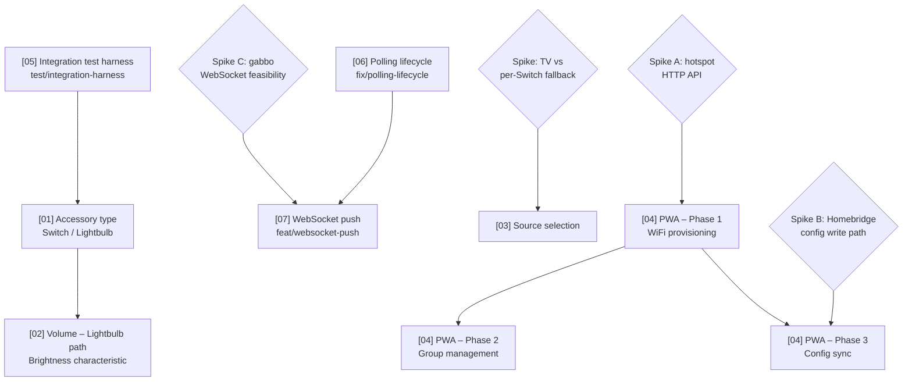

# Technical Roadmap

Last updated: 2026-06-21 (post v0.3.0 stable release)

This file gives the delivery order and dependency chain across all planned
features. The individual plan files contain the detail; this file answers
"what ships in what order and why."

## Dependency graph

## Current state (2026-06-21)

**v0.3.0 shipped as stable `latest`.** Beta releases were deleted; v0.3.0 is the current published version. All items previously marked "beta v0.3.0-beta.1" are done.

- **Done (v0.3.0):** [05] Integration test harness — **#58**. Fake HTTP server + HAP stub; polling neutralised with fake timers.
- **Done (v0.3.0):** [06] Polling lifecycle — **#65**. Polling stoppable on unregister/shutdown; `pollingInterval` config field.
- **Done (v0.3.0):** Spike C Part 1 — gabbo WebSocket harness — **#66**. Parse/dispatch validated; fake-gabbo test double in place.
- **Done (v0.3.0):** FirmwareRevision characteristic — **#83** (test), **#85** (fix). SCM `softwareVersion` component correctly sourced.
- **Done (v0.3.0):** [01] Accessory type — **#72**. `accessoryType: 'switch' | 'lightbulb'` threaded through config → accessory; orphan-service pruning on type change.
- **Done (v0.3.0):** [02] Volume — Lightbulb path — **#86** (feat), **#91** (race fix). Brightness 0–100 maps to volume; 0 = power off; non-blocking settle.
- **Done (v0.3.0):** XML escaping fix — **#110**. Escape special chars in fake-soundtouch-server error responses.
- **Cancelled:** [02] Volume — Switch path. **PR #62 was merged then reverted (#70)** — binary `On` only; volume requires 0–100 range.
- **Done (no release):** `prefer-it-over-test` sweep — **#98**. Mechanical `test()` → `it()` rename across all test files.
- **In-progress:** CHANGELOG.md — **#111**. Introduce `CHANGELOG.md` + wire `@semantic-release/changelog` / `@semantic-release/git`. `docs:` → no release.
- **Unblocked (planned):** Static factory enforcement — **#103 (plan)**. Private constructors on all classes + `API.create()` factory. `refactor:` → no release.
- **Unblocked (planned):** Disabled flag — **(2026-06-21 plan)**. `disabled: true` per-accessory unregisters the speaker from HomeKit without removing config. `feat:` → minor. Goes before WebSocket push to make testing easier.
- **Unblocked (planned):** Structured errors + logLevel — **#100 (plan)**. `ContextError`, native `Error.cause`, `logLevel` config, level-aware `FormattedLogger.error()`. `feat:` → minor. Goes before WebSocket push so logs are readable during Spike C Part 2.
- **Unblocked (planned):** Speaker zones — **#101 (plan)**. `zones` config array, `SoundTouchZoneAccessory`, zone API activation. `feat:` → minor.
- **Unblocked (spike):** Spike C Part 2 — real hardware capture session. Unblocks [07] WebSocket push (plan 06 ✅, Spike C Part 1 ✅). Run after disabled flag + logging land.
- **Blocked:** [07] WebSocket push — waiting on disabled flag + structured-errors/logLevel (testing prerequisites) and Spike C Part 2.
- **Blocked:** [03] Source selection (TV-vs-Switch spike), [04] PWA all phases (spikes A/B).

## Anticipated delivery order

| Order | Plan | Branch | Status | Why this position |
| ----- | ---- | ------ | ------ | ----------------- |
| 1 | **[05] Integration test harness** | `test/integration-harness` | ✅ beta v0.3.0-beta.1 (#58) | Pure test infrastructure, no release. Gives confidence before shipping any user-facing feature. |
| 2 | **[06] Polling lifecycle** | `fix/polling-lifecycle` | ✅ beta v0.3.0-beta.1 (#65) | Stop polling on accessory removal/shutdown; configurable interval. `fix:` → patch. |
| 2.5 | **Spike C Part 1 — gabbo harness** | `spike/gabbo-harness` | ✅ beta v0.3.0-beta.1 (#66) | Validated parse/dispatch; fake-gabbo test double ready. |
| 2.6 | **FirmwareRevision characteristic** | `test/firmware-revision-coverage` | ✅ beta v0.3.0-beta.1 (#83, #85) | SCM `softwareVersion` component correctly sourced and published. |
| 3 | **[01] Accessory type** | `feat/accessory-type` | ✅ beta v0.3.0-beta.1 (#72) | `accessoryType: 'switch' \| 'lightbulb'` threaded through config → accessory; orphan-service pruning on type change. `feat:` → minor. |
| 4 | **[02] Volume — Lightbulb path** | `feat/volume-control` | ✅ beta v0.3.0-beta.1 (#86, #91) | Brightness 0–100 maps to volume; 0 = power off; non-blocking settle for the `On`/`Brightness` race. |
| 4.5 | **prefer-it-over-test sweep** | `test/prefer-it-over-test` | ✅ dev (#98) | Mechanical `test()` → `it()` rename across all remaining test files. No production code, no release. |
| 4.6 | **Static factory enforcement** | `refactor/static-factory-enforcement` | 🟢 Next (unblocked) | Private constructors on all ten classes + `API.create()` factory. `refactor:` → no release. Small, purely mechanical, no new tests. |
| 4.7 | **Disabled flag** | `feat/disabled-flag` | 🟢 Next (unblocked) | `disabled: true` per-accessory unregisters speaker from HomeKit without removing config. `feat:` → minor. Testing prerequisite for WebSocket push. |
| 4.8 | **Structured errors + logLevel** | `feat/structured-errors-logging` | 🟢 Next (unblocked) | `ContextError` + native `Error.cause` chaining; `logLevel` config replaces `verbose: boolean`; level-aware `FormattedLogger.error()`. `feat:` → minor. No new deps. Testing prerequisite for WebSocket push. |
| 4.9 | **Speaker zones** | `feat/speaker-zones` | 🟢 Next (unblocked) | `zones` config array; `SoundTouchZoneAccessory`; zone API activation at startup sync. `feat:` → minor. Zone API already implemented in `api/zone.ts`. |
| 5 | **[07] WebSocket push (gabbo)** | `feat/websocket-push` | 🔴 Blocked | Blocked on disabled flag + structured-errors/logLevel (testing prerequisites) and Spike C Part 2 (real-device capture). Phased: P1 connection+lifecycle, P2 per-event mapping, P3 tune polling + edges. |
| 6 | **[03] Source selection** | `feat/source-selection` | 🔴 Blocked (spike) | Independent of 01/02. Blocked on a **spike** (verify Television+InputSource on a real device; choose TV path vs per-source Switch fallback). Cannot be committed until the spike resolves the architecture choice. |
| 7 | **[04] PWA — Phase 1** | `feat/pwa` | 🔴 Blocked (spike A) | Architecturally separate (new `web/` workspace + embedded HTTP server). Blocked on **spike A** (reverse-engineer the hotspot provisioning HTTP API at `http://192.0.2.1`). Phase 1 must ship before phases 2 and 3 (it creates the web scaffold and embedded server). |
| 8 | **[04] PWA — Phase 2** | `feat/pwa` | 🔴 Blocked (needs P1) | Group management via the zone API (`/getZone`, `/setZone`, etc. — already implemented in `src/devices/SoundTouch/api/zone.ts`). Needs the phase 1 PWA scaffold and embedded server to be in place. |
| 9 | **[04] PWA — Phase 3** | `feat/pwa` | 🔴 Blocked (spike B) | Homebridge config sync. Blocked on **spike B** (confirm atomic config write path safety under Homebridge). Requires phase 1 scaffold. |

## Session cost estimates

Per-plan estimate of how much of a single coding session each unit consumes, by
the methodology in `SKILL.md` step 5. Cost is driven by iteration loops
(read → edit → test → lint → fix), not line count. Bands: **Small** (room to
spare), **Medium** (one fits comfortably), **Heavy** (plan on one per session).
Update the band after each unit ships and note the variance — see "Calibration"
below.

| Plan | Band | Drivers that set the band | Session guidance |
| ---- | ---- | ------------------------- | ---------------- |
| **[05] Integration test harness** | Medium | New test infra (fake HTTP server + Homebridge stub) and a Jest `projects` split; lots of additive code but low iteration risk and no release | ✅ beta v0.3.0-beta.1 |
| **[06] Polling lifecycle** | Small–Medium | Modifies existing platform + accessory lifecycle (retain wrappers, stop on unregister/shutdown) and threads two config fields; async lifecycle reasoning + a couple of tests | ✅ beta v0.3.0-beta.1 |
| **[01] Accessory type** | Heavy | Config threading through `DeviceConfiguration`, branching the hardcoded Switch in `createAccessory`, and orphan-service pruning on type change | ✅ beta v0.3.0-beta.1 |
| **[02] Volume — Lightbulb path** | Small–Medium | `SoundTouchSpeakerBrightnessCharacteristic` + power/volume race fix; `On`/`Brightness` ordering needs careful handling | ✅ beta v0.3.0-beta.1 |
| **prefer-it-over-test sweep** | Small | Pure mechanical rename, no production code, no iteration risk | ✅ dev (#98) |
| **Static factory enforcement** | Small | Mechanical: add `private` to 10 constructors, add `API.create()`, update 3 test files. Typecheck is the gate — either it compiles or it doesn't. | 🟢 Next. One sitting, likely half a session. |
| **Structured errors + logLevel** | Medium | New `ContextError` class + `logLevel` config option threaded through `ExternalPlatformConfig` → `PlatformConfiguration` → `platform.ts`; `FormattedLogger.error()` rewrite for cause-chain traversal. TDD on `ContextError` and the formatter is the main loop. | 🟢 Next. Fits one session. |
| **Speaker zones** | Heavy | New `ZoneConfig` type + config schema update; `zones` threaded through `PlatformConfiguration`; `SoundTouchZoneAccessory` + `SoundTouchZoneOnCharacteristic`; startup `getZone()` sync per primary; zone set/dissolve via `setZone`/`removeZoneSlave`. Multiple new classes + config schema + integration path. | 🟢 Next. Plan a full session. |
| **[07] WebSocket push — Phase 1** | Heavy (est.) | New stateful per-device connection (connect/parse/reconnect/teardown), a new `ws`-backed fake-gabbo harness, and async lifecycle threaded through `platform.ts`/accessory; async timing + reconnect is high iteration risk | Plan a full session. Re-estimate after Spike C. Phases 2–3 are Medium. |
| **[03] Source selection** | TBD (blocked) | Estimate after the TV-vs-Switch spike resolves the architecture | Re-estimate once unblocked. |
| **[04] PWA — Phase 1–3** | TBD (blocked) | New `web/` workspace + embedded `src/server/`; estimate after spike A | Each phase is its own session at minimum. |

**Realistic capacity per session:** one Medium/Heavy plan to a shippable,
verified, pushed state; a second only if the first goes smoothly with budget to
spare. Three in one session is unlikely without compromising the test bar that
plan 05 exists to raise.

### Calibration

When a unit ships, record actual-vs-estimate here so future estimates sharpen.

| Date | Plan | Estimate | Actual | Variance / note |
| ---- | ---- | -------- | ------ | --------------- |
| 2026-06-20 | [05] Integration test harness | Medium | Medium–Heavy | HTTP fake server was trivial as predicted, but two unforeseen drivers pushed it up: the manual homebridge mock provides no Service/Characteristic (HAP stub written from scratch), and polling is hardcoded on (neutralised with fake timers). Lesson: when a test exercises framework wiring, budget for stubbing the framework surface, not just the protocol. |
| 2026-06-20 | [01] Accessory type | Heavy | Heavy | Full session as estimated. Config threading + orphan pruning touched many files; pruning logic needed extra iteration. |
| 2026-06-20 | [02] Volume — Lightbulb path | Small–Medium | Small–Medium | Landed as estimated. Race fix was the main loop as predicted; the `On`/`Brightness` ordering required a follow-up fix PR (#91). |
| 2026-06-21 | prefer-it-over-test sweep | Small | Small | Landed as estimated. Pure mechanical rename, no iteration needed. |

## Spikes (blockers)

Three features are gated on spikes that must happen on a real device before code
is written. These are not implementation tasks — they're time-boxed
investigations with a concrete question to answer.

### Spike A — SoundTouch setup-mode hotspot HTTP API
**Blocks:** plan 03 (TV path decision) is independent; plan 04 phase 1 is fully blocked.

What we know:
- Enter setup mode: hold **PRESET 2 + VOLUME DOWN** until Wi-Fi indicator turns solid amber.
- Speaker broadcasts "Bose SoundTouch Wi-Fi Network" hotspot.
- Setup web UI is at `http://192.0.2.1` (port 80). Note: `192.168.1.1` is a different Bose product — do not use.
- Standard SoundTouch API (port 8090) is also available at `192.0.2.1:8090` during setup.

What must be resolved:
1. Connect a laptop to the hotspot, open browser devtools, walk through WiFi setup. Capture: endpoints, methods, request/response bodies, any tokens.
2. Does the UI scan for available networks, or does the user type the SSID manually?
3. What happens after credentials are submitted — how long until the hotspot drops?
4. Does the phone reconnect to the home network automatically?

### Spike B — Homebridge config write path
**Blocks:** plan 04 phase 3.

What must be resolved:
1. `api.user.storagePath()` gives the writable directory — confirm atomic write (write-then-rename) doesn't corrupt Homebridge state.
2. Does Homebridge Config UI X watch for external config changes and reload, or is a restart always required?

### Spike C — gabbo WebSocket push feasibility
**Blocks:** plan 07 (WebSocket push). Plan 06 is the *other* prerequisite (shared lifecycle) but is not blocked by this spike.

**Question to answer:** does the gabbo channel (`ws://<ip>:8080`, sub-protocol
`gabbo`) deliver the state-change notifications we need, reliably enough to drive
(or augment) characteristic refresh — and what connection/reconnect/teardown
semantics must the client implement?

What we know (from `soundtouch-api-expert/api-reference.md` → "WebSocket
notifications"):
- Open with `new WebSocket("ws://<ip>:8080", "gabbo")`; the speaker pushes
  `<updates deviceID="…">` frames. Most are tickles (`<volumeUpdated/>`,
  `<nowPlayingUpdated>…`, `<bassUpdated/>`, `<zoneUpdated/>`, `<infoUpdated/>`,
  `<sourcesUpdated/>`); a few carry data inline (`presetsUpdated`,
  `nowPlayingUpdated`, `recentsUpdated`, `nowSelectionUpdated`).
- Empty `<updates …></updates>` frames act as a heartbeat.
- Node 22/24 ship a global `WebSocket` (undici) → **client needs no new runtime
  dependency**. A local fake-gabbo **server** for tests needs `ws` (devDep).
- **Correction to a prior assumption:** there is currently **no** WebSocket code
  in the repo. The volume plan's 2026-06-20 finding that an "existing per-device
  WebSocket connection" could be reused is **wrong** — confirmed by grep. The
  channel is greenfield.

**Two parts (split by hardware need):**

*Part 1 — no hardware (doable in-sandbox):*
- Build a throwaway probe client + a minimal `ws`-backed fake-gabbo server that
  emits the reference frames; prove sub-protocol negotiation, `<updates>`
  parsing (reuse `api/utils/xml-element.ts`), and tickle→re-GET dispatch.
- Output: validated parse/dispatch logic + a reusable test double.

*Part 2 — real hardware (needs a Bose SoundTouch speaker):*
- Run `node scripts/gabbo-probe.mjs <ip>` (to be written): open the socket, log
  every frame with timestamps for a session while the user toggles
  volume/power/source/preset from the Bose app.
- Capture and record in plan 07's findings:
  1. Is the `gabbo` sub-protocol accepted on connect?
  2. Do real frames match the v1.1 reference shapes?
  3. Heartbeat / empty-update cadence and idle-timeout behaviour.
  4. What happens to the socket on **standby/power-off** — closed? silent? Does
     it need a reconnect, and on what trigger?
  5. Reconnect/backoff behaviour after a drop; multi-device behaviour.
- **Time-box:** one capture session. We'll know by the end which events fire,
  their real shapes, and the connection lifecycle rules — enough to finalise the
  reconnect strategy and the polling-fallback interval.

**Status (2026-06-20):** Part 1 complete — gabbo harness shipped in #66 (beta v0.3.0-beta.1). Part 2 unblocked — real device available; run `node scripts/gabbo-probe.mjs <ip>` against the device to capture frames and answer the connection lifecycle questions above.

## Key coupling notes

- **Volume requires Lightbulb — the Switch path was cancelled.** HAP Switch exposes only a binary `On` characteristic; volume is a 0–100 range. `Lightbulb.Brightness` (0–100, where 0 = power off) is the correct mapping. Plan 01 (accessory type) is therefore the prerequisite for plan 02 (volume).
- **The integration test harness (plan 05) is infrastructure, not a feature.** It has no user impact and no release, but it provides the safety net that makes the subsequent feature PRs lower risk.
- **The PWA (plan 04) is architecturally independent** from the HomeKit features (plans 01–03). It introduces a new `web/` workspace and a `src/server/` embedded HTTP server — concerns that don't overlap with the HAP characteristic layer. Its phases can proceed in parallel with plans 01–03 once spike A is resolved.
- **Source selection (plan 03) is the highest-risk HomeKit feature.** The Television+InputSource pattern has real caveats (external publishing, `Active`/`On` power model clash, buried UX). The spike must answer the architecture question before any code is written; the per-source Switch fallback is the documented Plan B if the TV path is too rough.
- **WebSocket push (plan 07) augments polling — it does not replace it.** Plan 06 makes polling stoppable and configurable; plan 07 then makes WS the primary, instant refresh trigger while polling stays as a relaxed-interval fallback for dropped sockets / missed tickles. The two **share the connection-lifecycle code** (open on init, tear down on unregister/shutdown) and both edit `SoundTouchSpeakerPlatformAccessory.ts`/`platform.ts`, so plan 07 **must serialise after plan 06** — building it earlier would implement the same lifecycle twice and guarantee merge conflicts.
