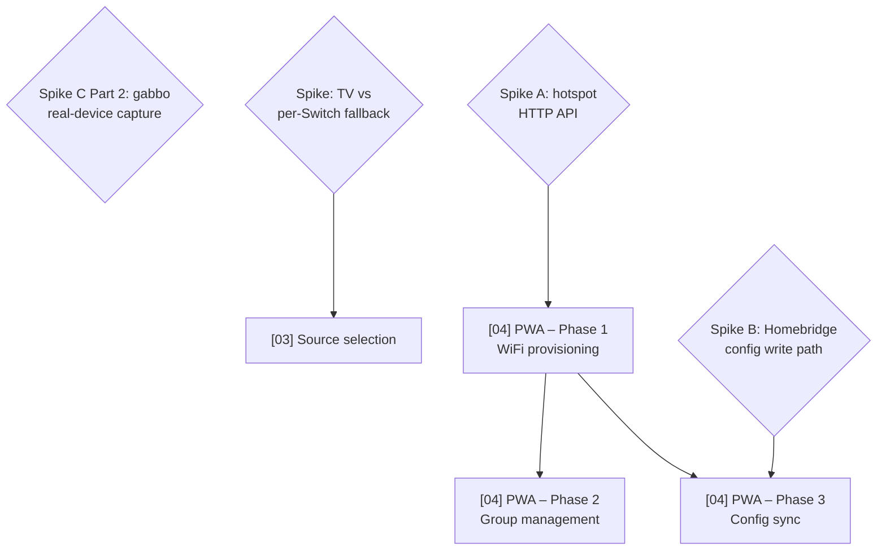

# Technical Roadmap

Last updated: 2026-07-10

This file gives the delivery order and dependency chain across all planned
features. The individual plan files contain the detail; this file answers
"what ships in what order and why." Done and cancelled items are removed —
see `plans/done/` for the historical record (`plans/cancelled/` is created
when the first plan is cancelled; none has been yet).

## Dependency graph

## Delivery order

| Order | Plan | Branch | Status | Why this position |
| ----- | ---- | ------ | ------ | ----------------- |
| 1 | **BoseCloudServer hardening** | `fix/bose-cloud-server-hardening` | 🟢 Ready (parallel-safe) | Security fix (station-id injection into outbound URLs) to code already in 0.4.0-beta — land before promoting dev→latest. `fix:` → patch. No file overlap with 2–4. |
| 2 | **Gabbo reconnect resilience** | `fix/gabbo-resilience` | 🟢 Ready (parallel-safe) | Reconnect backoff + half-open-socket detection; also unfreezes the reconciliation poll gated on `isConnected`. Delivers the reconnect portion of WebSocket Phase 3, narrowing Spike C Part 2 (see below). `fix:` → patch. |
| 3 | **Power state accuracy** | `fix/power-state-accuracy` | 🟢 Ready (parallel-safe) | `deviceIsOn` error propagation ("No Response" instead of false "Off"), toggle-drift fix, restore-context refresh, missing On-characteristic tests. `fix:` → patch. |
| 4 | **Plan hygiene + dead code** | `chore/plan-hygiene-dead-code` | 🟢 Ready (parallel-safe) | Deletes dead `TuneInClient`, corrects stale done-plan docs, schema description fix. `chore:` → no release. |
| 5 | **Speaker zones** | `feat/speaker-zones` | 🟢 Unblocked | `zones` config array; `SoundTouchZoneAccessory`; zone API activation at startup sync. `feat:` → minor. Zone API already implemented in `api/zone.ts`. Queued behind the remediation batch so the fixes ride the next beta. |
| 6 | **Spike C Part 2** | — | 🟡 Unblocked (needs real device) | Scope narrowed by plan 2 above: reconnect/half-open handling ships without capture data; remaining questions are standby socket behaviour and heartbeat cadence only. |
| 7 | **[03] Source selection** | `feat/source-selection` | 🔴 Blocked (spike) | Blocked on TV-vs-Switch spike (verify Television+InputSource on a real device). |
| 8 | **[04] PWA — Phase 1** | `feat/pwa` | 🔴 Blocked (spike A) | Blocked on spike A (reverse-engineer hotspot provisioning HTTP API at `http://192.0.2.1`). |
| 9 | **[04] PWA — Phase 2** | `feat/pwa` | 🔴 Blocked (needs P1) | Group management via zone API. Needs phase 1 scaffold. |
| 10 | **[04] PWA — Phase 3** | `feat/pwa` | 🔴 Blocked (spike B) | Homebridge config sync. Blocked on spike B + phase 1. |

Items 1–4 (the 2026-07-10 remediation batch from the post-#141 review) share no
files and can run as parallel engineer dispatches on separate branches.

## Session cost estimates

Per-plan estimate of how much of a single coding session each unit consumes.
Cost is driven by iteration loops (read → edit → test → lint → fix), not line
count. Bands: **Small** (room to spare), **Medium** (one fits comfortably),
**Heavy** (plan on one per session).

| Plan | Band | Drivers that set the band |
| ---- | ---- | ------------------------- |
| **BoseCloudServer hardening** | Small | Localised to one file; existing test harness already injects a mock axios; deterministic. |
| **Gabbo reconnect resilience** | Medium | Async timing iteration risk (fake timers for backoff + staleness); integration-test changes against the fake-gabbo harness. |
| **Power state accuracy** | Medium | Cross-file (device, accessory, characteristic, platform); new test file for the On characteristic; toggle semantics need care. |
| **Plan hygiene + dead code** | Small | Mechanical deletion + doc edits; knip run is the only iteration risk. |
| **Speaker zones** | Heavy | New `ZoneConfig` type + config schema; `zones` threaded through `PlatformConfiguration`; `SoundTouchZoneAccessory` + `SoundTouchZoneOnCharacteristic`; startup `getZone()` sync; zone set/dissolve via `setZone`/`removeZoneSlave`. |
| **[03] Source selection** | TBD (blocked) | Estimate after TV-vs-Switch spike resolves the architecture. |
| **[04] PWA — Phase 1–3** | TBD (blocked) | New `web/` workspace + embedded `src/server/`. Each phase its own session minimum. |

**Realistic capacity per session:** one Medium/Heavy plan fully verified and
pushed; a second only if the first reaches green with budget clearly remaining.

Estimate-vs-actual history lives in `CALIBRATION.md` (this directory) — consult
it when sizing a new plan against comparable past work, and append a row there
each time a unit ships.

## Spikes (blockers)

### Spike A — SoundTouch setup-mode hotspot HTTP API
**Blocks:** [04] PWA Phase 1.

What we know:
- Enter setup mode: hold **PRESET 2 + VOLUME DOWN** until Wi-Fi indicator turns solid amber.
- Speaker broadcasts "Bose SoundTouch Wi-Fi Network" hotspot.
- Setup web UI is at `http://192.0.2.1` (port 80). Note: `192.168.1.1` is a different Bose product — do not use.
- Standard SoundTouch API (port 8090) also available at `192.0.2.1:8090` during setup.

What must be resolved:
1. Connect a laptop to the hotspot, open browser devtools, walk through WiFi setup. Capture: endpoints, methods, request/response bodies, any tokens.
2. Does the UI scan for available networks, or does the user type the SSID manually?
3. What happens after credentials are submitted — how long until the hotspot drops?
4. Does the phone reconnect to the home network automatically?

### Spike B — Homebridge config write path
**Blocks:** [04] PWA Phase 3.

What must be resolved:
1. `api.user.storagePath()` gives the writable directory — confirm atomic write (write-then-rename) doesn't corrupt Homebridge state.
2. Does Homebridge Config UI X watch for external config changes and reload, or is a restart always required?

### Spike C Part 2 — gabbo WebSocket real-device capture
**Blocks:** [07] WebSocket Phase 3 only (Phase 1 is now unblocked — see below). Part 1 complete (#66).

**Scope narrowed (2026-07-10):** the `fix/gabbo-resilience` plan implements
reconnect backoff and half-open-socket detection without needing capture data,
answering question 5 and most of the reconnect tuning. Only questions 3
(heartbeat cadence / idle timeout) and 4 (standby socket behaviour) still need
a real-device capture.

**Status (2026-06-22):** Questions 1 and 2 below are **confirmed** by reference implementation `Dress13/homebridge-bose-soundtouch` (TypeScript, real-device tested): `gabbo` sub-protocol accepted; all major event shapes match the v1.1 reference; several carry inline data (volume, nowPlaying, presets, zone, bass). Fixed 5 s reconnect + 30 s client-side ping confirmed sufficient in practice.

Remaining open questions (still need real-device capture):

3. Heartbeat / empty-update cadence and server-side idle-timeout behaviour.
4. What happens to the socket on **standby/power-off** — closed? silent? Reconnect trigger?
5. Multi-device reconnect behaviour after a drop.

Run a focused gabbo capture against the device while toggling volume/power/source/preset and putting it into standby.

**Time-box:** one capture session.

## Key coupling notes

- **WebSocket push (plan 07) augments polling — it does not replace it.** Phase 1/2 is in beta. Polling stays as a fallback until Phase 3 resolves standby/reconnect behaviour.
- **Source selection is the highest-risk HomeKit feature.** The Television+InputSource pattern has real caveats (external publishing, `Active`/`On` power model clash, buried UX). The per-source Switch fallback is Plan B if the TV path is too rough.
- **The PWA is architecturally independent** from the HomeKit features. It introduces a new `web/` workspace and `src/server/` embedded HTTP server — no overlap with the HAP characteristic layer.
- **Typed preset management (plan 08) is in beta.** A future plan can wire up HomeKit controls (preset select, station status) or PWA management once the current Bose cloud emulator/manual setup path is settled.

## Backlog (not yet planned)

- **Preset-sync host/port decoupling.** soundcork users shouldn't need
  `server.enabled` to use preset sync. Platform gating is already independent
  (`_setupPresets` keys off `presetSyncEnabled` only), but there is no
  `presetSync.host`/`presetSync.port` override — presets store relative
  `location` paths and playback relies on the DNS redirect described in
  `docs/bose-cloud-setup.md`. Needs an architect plan when prioritised.
- **Volume-slider debounce + refresh coalescing.** Deliberately deferred from
  the power-state-accuracy plan (last-write-wins today, harmless). Revisit
  alongside source selection, which adds more characteristic traffic.
