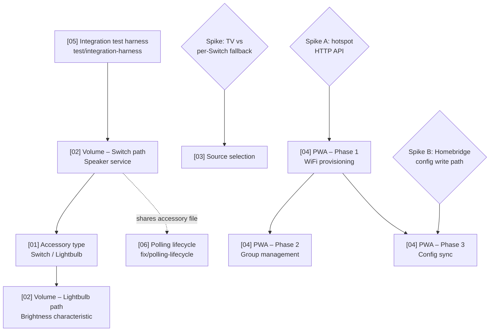

# Technical Roadmap

Last updated: 2026-06-20

This file gives the delivery order and dependency chain across all planned
features. The individual plan files contain the detail; this file answers
"what ships in what order and why."

## Dependency graph

## Current state (2026-06-20)

- **Now:** [05] Integration test harness — **PR #58 open against `dev`**, with a
  coverage-threshold guard added per review; awaiting merge.
- **Next (ready):** [02] Volume — Switch path. Cut `feat/volume-control` off `dev`
  once #58 merges. The `On` setter's 5 s `finally` race fix is now **in scope**
  for this plan (promoted from a finding).
- **Tech debt (ready):** [06] Polling lifecycle — make polling stoppable on
  removal/shutdown and configurable. Shares `SoundTouchSpeakerPlatformAccessory.ts`
  with plan 02, so **serialise after 02** to avoid conflicts.
- **Blocked:** [03] Source selection (spike), [04] PWA all phases (spikes A/B).
- Skill changes landed in `dev`: session-cost estimation (#57), planning vs.
  implementation branches (#59), roadmap status + plan-05 calibration (#60).

## Anticipated delivery order

| Order | Plan | Branch | Status | Why this position |
| ----- | ---- | ------ | ------ | ----------------- |
| 1 | **[05] Integration test harness** | `test/integration-harness` | 🔵 PR #58 open (review) | Pure test infrastructure, no release. Gives confidence before shipping any user-facing feature. No dependencies. |
| 2 | **[02] Volume — Switch path** | `feat/volume-control` | 🟢 Ready (next) | Adds immediate value to all existing users on the default Switch accessory type. The Speaker-service path has no dependency on plan 01. Ships first so volume isn't blocked on the accessory-type rework. Now also owns the `On` setter 5 s-sleep race fix. |
| 3 | **[06] Polling lifecycle** | `fix/polling-lifecycle` | 🟢 Ready (tech debt) | Stop polling on accessory removal/shutdown; make the interval configurable (`0` disables). Surfaced by plan 05. Shares `SoundTouchSpeakerPlatformAccessory.ts` with plan 02 → serialise after 02. `fix:` → patch. |
| 4 | **[01] Accessory type** | `feat/accessory-type` | ⚪ Planned | Independent of plans 02 and 03, but it's the gate for the Lightbulb/Brightness volume path. Delivering it after the Switch volume path avoids holding volume hostage to the larger config-threading change. |
| 5 | **[02] Volume — Lightbulb path** | (small follow-up PR or bundled with 01) | ⚪ Planned (gated on 01) | Brightness characteristic wiring is a small addition once plan 01's `accessoryType` gate exists. Can ship in the same PR as plan 01 or immediately after. |
| 6 | **[03] Source selection** | `feat/source-selection` | 🔴 Blocked (spike) | Independent of 01/02. Blocked on a **spike** (verify Television+InputSource on a real device; choose TV path vs per-source Switch fallback). Cannot be committed until the spike resolves the architecture choice. |
| 7 | **[04] PWA — Phase 1** | `feat/pwa` | 🔴 Blocked (spike A) | Architecturally separate (new `web/` workspace + embedded HTTP server). Blocked on **spike A** (reverse-engineer the hotspot provisioning HTTP API at `http://192.0.2.1`). Phase 1 must ship before phases 2 and 3 (it creates the web scaffold and embedded server). |
| 8 | **[04] PWA — Phase 2** | `feat/pwa` | 🔴 Blocked (needs P1) | Group management via the zone API (`/getZone`, `/setZone`, etc. — already implemented in `src/devices/SoundTouch/api/zone.ts`). Needs the phase 1 PWA scaffold and embedded server to be in place. |
| 9 | **[04] PWA — Phase 3** | `feat/pwa` | 🔴 Blocked (spike B) | Homebridge config sync. Blocked on **spike B** (confirm atomic config write path safety under Homebridge). Requires phase 1 scaffold. |

## Session cost estimates

Per-plan estimate of how much of a single coding session each unit consumes, by
the methodology in `SKILL.md` step 5. Cost is driven by iteration loops
(read → edit → test → lint → fix), not line count. Bands: **Small** (room to
spare), **Medium** (one fits comfortably), **Heavy** (plan on one per session).
Update the band after each unit ships and note the variance — see "Calibration"
below.

| Plan | Band | Drivers that set the band | Session guidance |
| ---- | ---- | ------------------------- | ---------------- |
| **[05] Integration test harness** | Medium | New test infra (fake HTTP server + Homebridge stub) and a Jest `projects` split; lots of additive code but low iteration risk and no release | Best first pick — de-risks every later feature PR. ~10 checklist items. |
| **[02] Volume — Switch path** | Medium | Pure HomeKit wiring (API already done), but the `On` setter's 5s `finally` sleep introduces a race that needs debounce/reconcile + tests | One known hazard drives the iteration. Highest user value. ~11 items. |
| **[01] Accessory type** | Heavy | Config threading through `DeviceConfiguration`, branching the hardcoded Switch in `createAccessory` (`:71`), and orphan-service pruning on type change | Plan a full session. Gates the Lightbulb volume follow-up. ~11 items. |
| **[02] Volume — Lightbulb path** | Small | Brightness characteristic wiring once plan 01's `accessoryType` gate exists | Bundle into plan 01's PR or a quick follow-up. |
| **[06] Polling lifecycle** | Small–Medium | Modifies existing platform + accessory lifecycle (retain wrappers, stop on unregister/shutdown) and threads two config fields; async lifecycle reasoning + a couple of tests | Contained; the integration harness already exercises the lifecycle path. |
| **[03] Source selection** | TBD (blocked) | Estimate after the TV-vs-Switch spike resolves the architecture | Re-estimate once unblocked. |
| **[04] PWA — Phase 1–3** | TBD (blocked) | New `web/` workspace + embedded `src/server/`; estimate after spike A | Each phase is its own session at minimum. |

**Realistic capacity per session:** one Medium/Heavy plan to a shippable,
verified, pushed state; a second only if the first goes smoothly with budget to
spare. Three in one session is unlikely without compromising the test bar that
plan 05 exists to raise.

### Calibration

When a unit ships, record actual-vs-estimate here so future estimates sharpen.

| Date | Plan | Estimate | Actual | Variance / note |
| ---- | ---- | -------- | ------ | --------------- |
| 2026-06-20 | [05] Integration test harness | Medium | Medium–Heavy | HTTP fake server was trivial as predicted, but two unforeseen drivers pushed it up: the manual homebridge mock provides no Service/Characteristic (HAP stub written from scratch), and polling is hardcoded on (neutralised with fake timers). Lesson: when a test exercises framework wiring, budget for stubbing the framework surface, not just the protocol. |

## Spikes (blockers)

Two features are gated on spikes that must happen on a real device before code
is written. These are not implementation tasks — they're time-boxed
investigations with a concrete question to answer.

### Spike A — SoundTouch setup-mode hotspot HTTP API
**Blocks:** plan 03 (TV path decision) is independent; plan 04 phase 1 is fully blocked.

What we know:
- Enter setup mode: hold **PRESET 2 + VOLUME DOWN** until Wi-Fi indicator turns solid amber.
- Speaker broadcasts "Bose SoundTouch Wi-Fi Network" hotspot.
- Setup web UI is at `http://192.0.2.1` (port 80). Note: `192.168.1.1` is a different Bose product — do not use.
- Standard SoundTouch API (port 8090) is also available at `192.0.2.1:8090` during setup.

What must be resolved:
1. Connect a laptop to the hotspot, open browser devtools, walk through WiFi setup. Capture: endpoints, methods, request/response bodies, any tokens.
2. Does the UI scan for available networks, or does the user type the SSID manually?
3. What happens after credentials are submitted — how long until the hotspot drops?
4. Does the phone reconnect to the home network automatically?

### Spike B — Homebridge config write path
**Blocks:** plan 04 phase 3.

What must be resolved:
1. `api.user.storagePath()` gives the writable directory — confirm atomic write (write-then-rename) doesn't corrupt Homebridge state.
2. Does Homebridge Config UI X watch for external config changes and reload, or is a restart always required?

## Key coupling notes

- **Volume and accessory type are intentionally decoupled for delivery.** Plan 02's Switch/Speaker path ships first and independently; the Lightbulb/Brightness path is a small follow-up gated on plan 01. Users get volume control without waiting for the accessory-type rework.
- **The integration test harness (plan 05) is infrastructure, not a feature.** It has no user impact and no release, but it provides the safety net that makes the subsequent feature PRs lower risk.
- **The PWA (plan 04) is architecturally independent** from the HomeKit features (plans 01–03). It introduces a new `web/` workspace and a `src/server/` embedded HTTP server — concerns that don't overlap with the HAP characteristic layer. Its phases can proceed in parallel with plans 01–03 once spike A is resolved.
- **Source selection (plan 03) is the highest-risk HomeKit feature.** The Television+InputSource pattern has real caveats (external publishing, `Active`/`On` power model clash, buried UX). The spike must answer the architecture question before any code is written; the per-source Switch fallback is the documented Plan B if the TV path is too rough.
